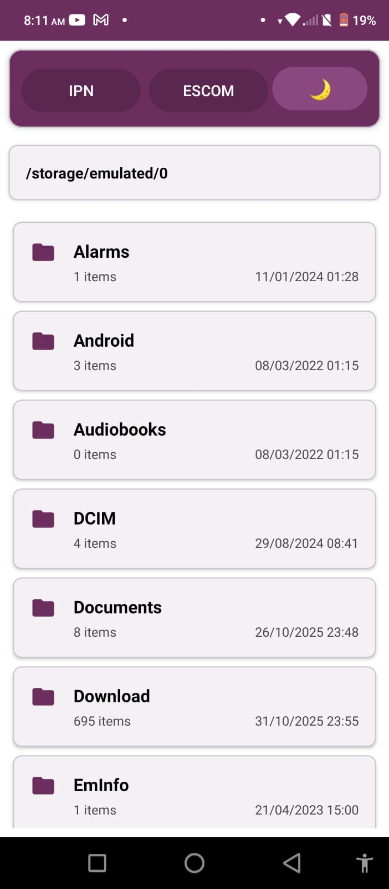
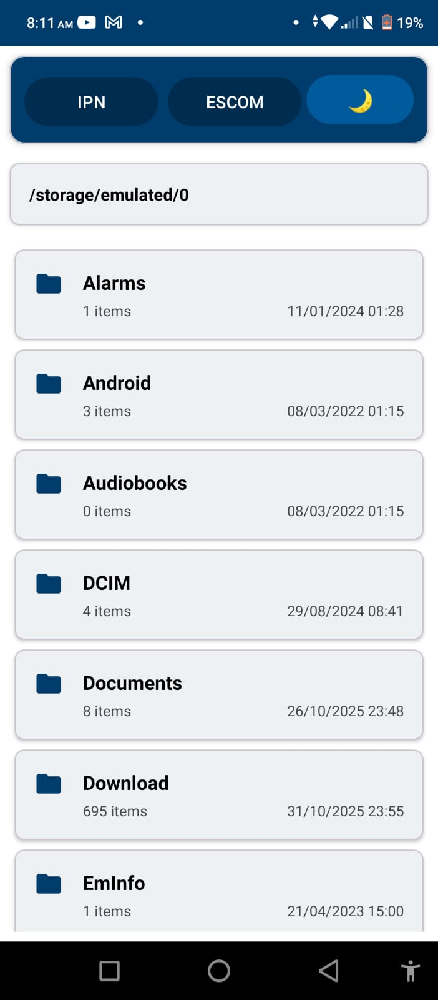
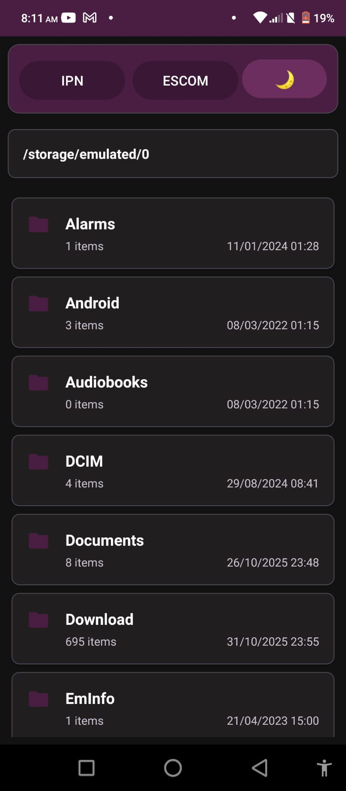
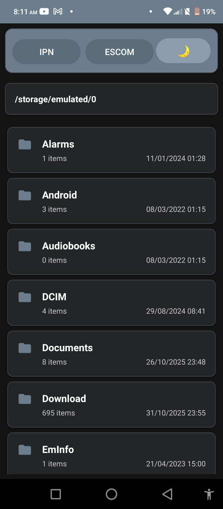
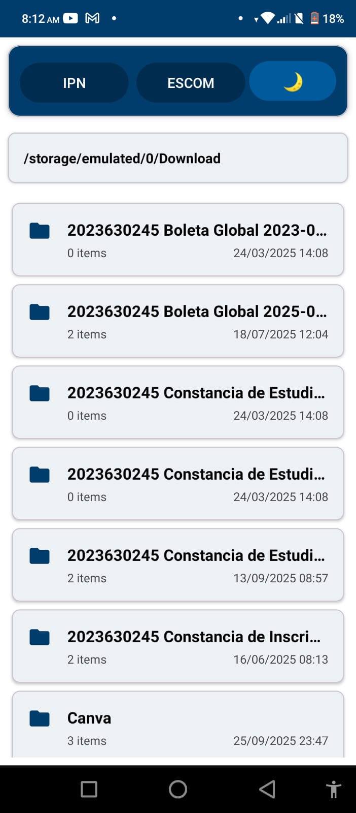
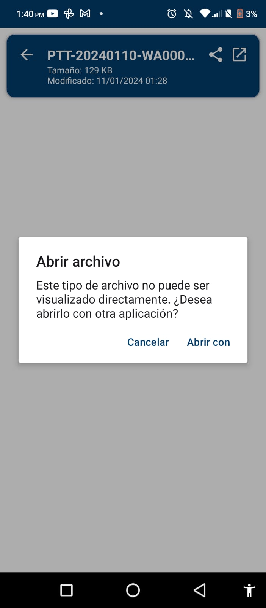
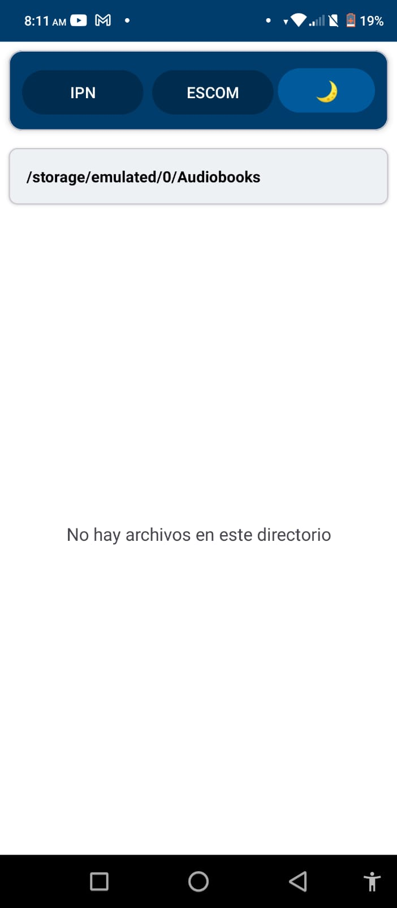
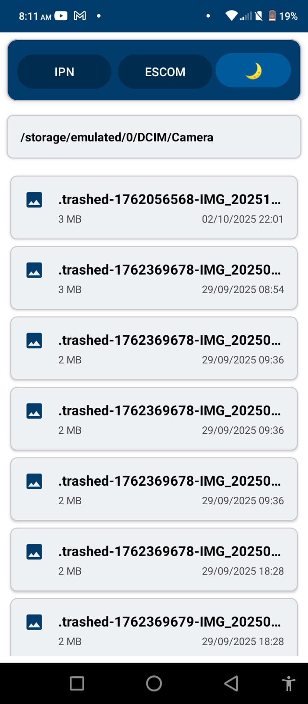

<h1 align="center">Práctica 4: Manejo de Archivos en Android</h1>

---

## Insignias

---

## Índice
- [Título](#practica-4-manejo-de-archivos-en-android)
- [Insignias](#insignias)
- [Índice](#índice)
- [Objetivo](#objetivo)
- [Marco Teórico](#marco-teorico)
- [Descripción del proyecto](#descripción-del-proyecto)
- [Implementación de Temas con SharedPreferences](#implementación-de-Temas-con-SharedPreferences)
- [Descripción de cómo se implementó la funcionalidad de cambio de tema](#descripción-de-como-se-implementó-la-funcionalidad-de-cambio-de-tema)
- [Ejemplo de Uso](#ejemplo-de-uso)
- [Estado de la tarea](#estado-de-la-tarea)
- [Características de la aplicación](#características-de-la-aplicación)
- [Acceso al proyecto](#acceso-al-proyecto)
- [Tecnologías utilizadas](#tecnologías-utilizadas)
- [Desarrollador](#-desarrollador)

---

## Objetivo

Desarrollar aplicaciones nativas para Android que implementen técnicas avanzadas de manejo de archivos, incluyendo almacenamiento local, lectura y escritura de archivos en diferentes formatos, y
visualización de contenido multimedia.

---

## Marco Teórico
<h3>Manejo de archivos en Android</h3>

Las aplicaciones nativas se desarrollan específicamente para un sistema operativo (Android, iOS) usando sus lenguajes y herramientas oficiales, ofreciendo el mejor rendimiento, acceso completo al hardware y una experiencia fluida. Las híbridas utilizan tecnologías web (HTML, CSS, JavaScript) dentro de un contenedor nativo, permitiendo una sola base de código para múltiples plataformas, aunque con rendimiento intermedio. Las web apps se ejecutan en el navegador, no requieren instalación y son fáciles de actualizar, pero dependen de Internet y tienen acceso limitado a funciones del dispositivo.

Android implementa un sistema de permisos robusto para el acceso al almacenamiento. A partir de Android 6.0 se requiere solicitar permisos en tiempo de ejecución. Para versiones Android 10+ es necesario gestionar el acceso a archivos mediante almacenamiento con scope o permisos de administrador de almacenamiento. El almacenamiento se divide en interno y externo. El almacenamiento interno es privado de la aplicación, mientras que el externo puede ser accedido por otras aplicaciones y requiere permisos específicos.

Las aplicaciones pueden navegar por la estructura de archivos utilizando la clase File para representar archivos y directorios. Se implementa typically una interfaz de exploración que muestra carpetas y archivos de forma jerárquica, permitiendo a los usuarios navegar hacia adelante y atrás entre directorios. Para archivos de texto como TXT, MD, JSON y XML, se implementan visores que muestran el contenido formateado adecuadamente. Las imágenes se visualizan con capacidades de zoom y rotación. Para formatos no soportados nativamente, se ofrece la opción de abrir con otras aplicaciones instaladas en el dispositivo.

---

## Descripción del proyecto

En esta aplicación se implementó un gestor de archivos del sistema, que accede a las carpetas del sistema para visualizar los diferentes archivos que existen, de tal forma que el usuario puede navegar entre las carpetas creadas para visualizar un archivo. Una vez que el usuario ingresa podrá ver el archivo desplegado o usar una aplicación diferente si el programa no le permite visualizarlo.

  

Este proyecto requiere Android Studio, con soporte para Kotlin y Material3. Se requiere una API nivel 26 (Android 8.0) como mínimo, extendiendo soporte hasta versiones recientes. Esto asegura compatibilidad con la mayoría del mercado actual manteniendo funcionalidades esenciales.

---

## Implementación de Temas con SharedPreferences
<table>
  <tr>
    <th>Modo guinda</th>
    <th>Modo azul</th>
    <th>Oscuro</th>
  </tr>
  <tr>
    <th>
      
    </th>
    <th>
      
    </th>
    <th>
      
    </th>
  </tr>
</table>

---

## Descripción de cómo se implementó la funcionalidad de cambio de tema

 La funcionalidad de cambio de tema se implementó permitiendo al usuario seleccionar entre tres estilos visuales predefinidos: guinda, azul y oscuro. Cada tema corresponde a un conjunto de atributos definidos en los archivos de recursos themes.xml y themes.xml (night) para manejar tanto la apariencia clara como la oscura. Al seleccionar un tema, la aplicación guarda la preferencia del usuario, generalmente mediante SharedPreferences, y aplica el estilo correspondiente a toda la actividad o fragmento, de modo que los colores principales, secundarios y de fondo se ajusten automáticamente según el tema elegido. 

---

## Ejemplo de Uso

La aplicación está diseñada con una arquitectura basada en activity's y fragmentos. Cada que el usuario quiera navegar a una nueva carpeta, se activara un activity que le permitirá visualizar los archivos que contiene dicha carpeta. Si se trata de imagenes, se visualizaran y se podrá hacer zoom, pero si son archivos, se mostraran sólo algunos de ellos, ya que la aplicación no puede abrir cierto tipo de archivos.

<table style="margin-left: auto; margin-right: auto;">
  <tr>
    <th colspan="4" style="text-align: center;">Uso</th>
  </tr>
  <tr>
    <th>
      
    </th>
    <th>
      
    </th>
    <th>
      
    </th>
    <th>
      
    </th>
  </tr>
</table>

---

## Estado de la tarea
- ✅ Tarea finalizada

---

## Características de la aplicación 
- [x] Pantalla de inicio
- [x] Uso de Activities
- [x] Uso de Fragments
- [x] Uso de themes (IPN/ESCOM) con sus correspondientes versiones en modo oscuro
- [x] Manejo de archivos 
- [x] Visualización de diferentes tipos de archivos 
- [x] Compartir archivos
- [x] Uso de permisos para gestionar archivos  

---

## Acceso al proyecto

Comando para clonar repositorio:

git clone https://github.com/Alfx17/Practica4.git

---

## Tecnologías utilizadas
- Kotlin
- Android Studio

---

## Desarrollador

- Flores Morales Aldahir Andrés
